# SIFT

An AI-powered resume screening platform that processes multiple resumes against a job description using a multi-agent LangGraph pipeline, returning structured match scores, confidence levels, and hiring recommendations.

https://sift-matching.vercel.app

---

## Table of Contents

- [Overview](#overview)
- [Architecture](#architecture)
- [Tech Stack](#tech-stack)
- [Agent Pipeline](#agent-pipeline)
- [Scoring Model](#scoring-model)
- [Setup & Installation](#setup--installation)
- [Usage](#usage)
- [Trade-offs & Design Decisions](#trade-offs--design-decisions)

---

## Overview

SIFT lets hiring teams upload a job description and one or more resumes, then runs each resume through a LangGraph-powered multi-agent pipeline to produce a structured screening result per candidate. Results are ranked by match score and presented with reasoning, a view-resume button, and human-review flags for borderline cases.

All AI calls use **Gemini 2.5 Flash at temperature 0** for deterministic, consistent output. The final match score and recommendation are computed with a deterministic weighted formula — not by the LLM — eliminating scoring variance across runs.

---

## Architecture

### LangGraph Pipeline

<p align="center">
  
</p>

**Key design choices:**
- `skillExtractor` and `jobAnalyzer` run in parallel from `__start__`, cutting wall-clock time
- If the job description is detected as vague, the pipeline short-circuits directly to `decisionMaker` and flags for human review
- Each resume is processed as a fully independent graph invocation, all running concurrently via `Promise.all`

### Shared State

```typescript
interface AgentState {
  resumeText: string;
  jobDescription: string;
  geminiApiKey: string;
  candidateName: string;
  extractedSkills: string[];
  experience: string;
  education: string;
  jobRequirements: {
    requiredSkills: string[];
    preferredSkills: string[];
    experienceYears?: number;
    education?: string;
    isVague?: boolean;
  };
  matchDetails: {
    skillMatches: string[];
    skillGaps: string[];
    preferredMatches: string[];
    experienceMatch: boolean;
    educationMatch: boolean;
  };
  result: {
    matchScore: number;
    confidence: number;
    recommendation: string;
    requiresHuman: boolean;
    reasoning: string;
  } | null;
}
```

---

## Tech Stack

| Layer | Technology |
|---|---|
| Framework | Next.js (App Router) |
| Language | TypeScript |
| AI Orchestration | LangGraph (`@langchain/langgraph`) |
| LLM | Gemini 2.5 Flash (`@google/generative-ai`) |
| Auth | BetterAuth + `@convex-dev/better-auth` |
| Database | Convex |
| Styling | Tailwind CSS |
| Animations | Framer Motion |
| Fonts | Plus Jakarta Sans (body), Syne (wordmark) |
| Toasts | Sonner |
| File Parsing | pdf2json (PDF), mammoth (DOCX) |
| Icons | lucide-react |

---

## Agent Pipeline

### 1. Skill Extractor
Analyzes the resume and extracts structured candidate data.

```
Input:  resumeText
Output: candidateName, extractedSkills[], experience, education
```

Prompts Gemini to return JSON. Runs in parallel with jobAnalyzer.

### 2. Job Analyzer
Parses the job description into structured requirements. Flags vague postings.

```
Input:  jobDescription
Output: requiredSkills[], preferredSkills[], experienceYears, education, isVague
```

A posting is flagged vague if it has fewer than 3 specific technical skills or is under 100 characters. Vague postings skip the matcher and go directly to decisionMaker with `requiresHuman: true`.

### 3. Matcher
Compares the candidate profile against job requirements.

```
Input:  extractedSkills, experience, education, jobRequirements
Output: skillMatches[], skillGaps[], preferredMatches[], experienceMatch, educationMatch
```

Instructs Gemini to apply semantic equivalence when matching (e.g. "React" matches "React.js", "ML" matches "Machine Learning").

### 4. Decision Maker
Computes the final score deterministically, then uses Gemini only to write the reasoning text.

```
Input:  matchDetails, jobRequirements
Output: matchScore, confidence, recommendation, requiresHuman, reasoning
```

See [Scoring Model](#scoring-model) below.

---

## Scoring Model

The match score is computed entirely in code — the LLM does not produce the number.

```
matchScore =
  (required skill match ratio) × 0.55 +
  (preferred skill match ratio) × 0.15 +
  (experience score)            × 0.20 +
  (education score)             × 0.10
```

**Dimension scoring:**

| Dimension | Condition | Score |
|---|---|---|
| Required skills | matched / total required | 0.0 – 1.0 |
| Preferred skills | matched / total preferred | 0.0 – 1.0 |
| Experience | requirement not specified | 0.5 (neutral) |
| Experience | meets requirement | 1.0 |
| Experience | does not meet requirement | 0.25 (partial credit) |
| Education | requirement not specified | 0.5 (neutral) |
| Education | meets requirement | 1.0 |
| Education | does not meet requirement | 0.35 (partial credit) |

**Recommendation thresholds:**

| Score | Recommendation | Human review |
|---|---|---|
| ≥ 0.65 | Proceed to interview | No |
| 0.35 – 0.65 | Needs manual review | Yes |
| < 0.35 | Reject | No |

**Confidence** is computed from how many dimensions were actually specified in the job description (skills, experience, education). A fully specified JD gives a confidence up to 1.0; a sparse JD floors at 0.5.

---

## Setup & Installation

### Prerequisites
- Node.js 18+
- A [Convex](https://convex.dev) account
- A [Google AI Studio](https://aistudio.google.com/app/apikey) account (for the Gemini API key — entered per-user in the app, not baked into the deployment)
- Google Cloud Console OAuth credentials (for Google sign-in)

### Installation

```bash
git clone <repository-url>
cd resume-matching
npm install
```

### Convex setup

```bash
npx convex dev
```

This creates your deployment and generates `convex/_generated/`. In the Convex dashboard under **Settings → Environment Variables**, set:

```
BETTER_AUTH_SECRET     # random secret, e.g. openssl rand -base64 32
APP_URL                # http://localhost:3001 for dev, your domain for prod
GOOGLE_CLIENT_ID       # from Google Cloud Console
GOOGLE_CLIENT_SECRET   # from Google Cloud Console
```

### Google OAuth setup

In [Google Cloud Console](https://console.cloud.google.com) → APIs & Services → Credentials → your OAuth 2.0 Client, add to **Authorized redirect URIs**:

```
http://localhost:3001/api/auth/callback/google
```

### Environment variables

`.env.local` (auto-generated by `npx convex dev`, add the last line):

```env
CONVEX_DEPLOYMENT=...
NEXT_PUBLIC_CONVEX_URL=...
NEXT_PUBLIC_CONVEX_SITE_URL=...
NEXT_PUBLIC_APP_URL=http://localhost:3001
```

### Run

```bash
npm run dev
```

Open `http://localhost:3001`.

---

## Usage

### First time

1. Sign up at `/sign-up` (email/password or Google)
2. Go to **Settings** and paste your Gemini API key — it is stored in your browser's localStorage for 7 days, never on the server

### Screening

1. Enter a position title and paste the job description
2. Drop or browse for one or more resumes (PDF, DOCX, DOC)
3. Click **Run screening**
4. Results appear ranked by match score — each card shows the candidate name, match %, confidence, recommendation, reasoning, and a **View resume** button

---

## Trade-offs & Design Decisions

**User-provided API key** — each user brings their own Gemini key. This avoids running up costs on a shared key and keeps the LLM usage attributable. The key is stored in localStorage (7-day expiry) and sent only to your own Next.js API route, never persisted server-side.

**Deterministic scoring** — moving score computation out of the LLM eliminates run-to-run variance. The LLM is only used for text generation (skill lists, reasoning), where minor wording variation is acceptable.

**Session-based results storage** — screening results (including resume PDFs as base64) are stored in `sessionStorage` keyed by a UUID. This avoids storing potentially sensitive resume data in the database while still enabling the results page to function. Results are lost when the browser tab closes.

**Parallel pipeline** — `skillExtractor` and `jobAnalyzer` run concurrently, and all resumes are processed concurrently via `Promise.all`. For a batch of 5 resumes the wall-clock time is roughly the same as processing one.

**Auth proxy** — BetterAuth runs on Convex's HTTP router. To avoid CORS issues, all `/api/auth/*` requests go through a Next.js catch-all proxy route that forwards server-to-server to Convex.

---

## License

MIT — see [LICENSE](LICENSE) for details.
